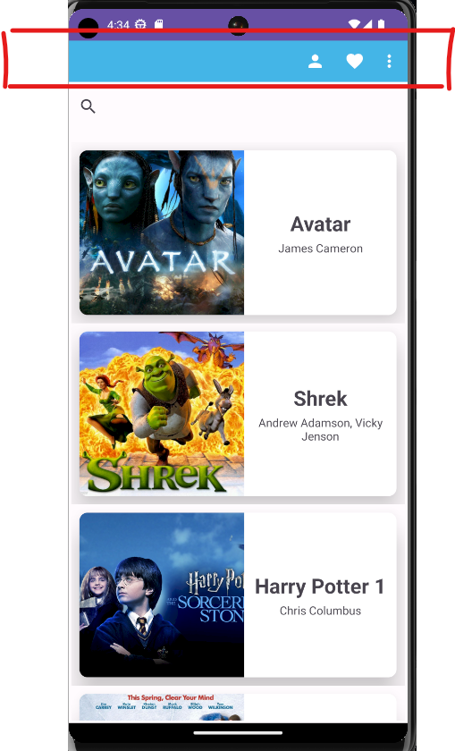

# NavigationDrawer-RecyclerView-SearchView-AndroidStudio-Java
In this project, an application supported by a toolbar that lists movies and includes a search feature in these movies was developed. Features used:
- Navigation Drawer
- Recycler View
- Search View

### Navigation Drawer
-In this project, a horizontal navigation drawer (toolbar) was developed.
-When the project was first opened, the icons seen at the top of the home page were defined in the file in the menu directory.
-Typically, these elements are specified with a name, an icon, and an ID. This method is a common approach used to organize the content of the navigation drawer and facilitate user navigation within the application.    
-Items that do not appear in the toolbar are displayed when you press the area indicated by 3 dots.

  
-Related components: toolbar_menu, activity_main, MainActivity

    

### Recycler View
-When opened in Mainactivity, movies are listed with their names, posters and directors.
-Vertical recycler view was used.    

  

  

  
-Related components: movie_item_list, activity_main, MovieData, MovieAdapter, MainActivity

    

### Search View
